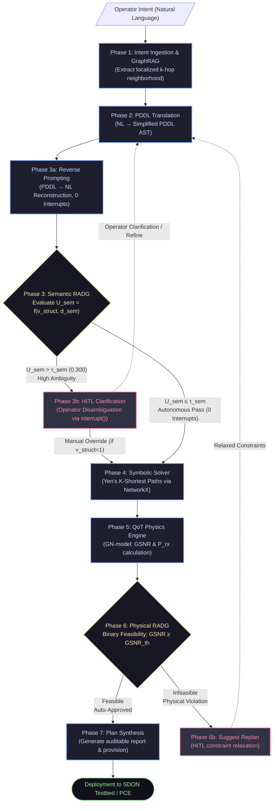

# MultiAgent-ON: LLM-Assisted Risk-Adaptive Decision Gates for Intent-Based Optical Networks (V5)

[](https://www.python.org/downloads/)
[](https://docs.astral.sh/uv/)
[](https://github.com/langchain-ai/langgraph)
[](tests/)
[](docs/architecture/Architecture_v5.md)
[](docs/architecture/ProblemStatement_v5.md)

**MultiAgent-ON** is a carrier-grade neurosymbolic intent orchestration platform that translates high-level natural language operator intents into formally validated, physically feasible optical lightpath configurations over the **17-Node Nobel-Germany Core Optical Backbone**.

By decoupling probabilistic natural language reasoning from deterministic symbolic solvers and physical transmission modeling, the framework introduces **Pre-Deployment Risk-Adaptive Decision Gates (RADGs)**. This dual-gate mechanism evaluates semantic uncertainty ($U_{sem}$) and physical Quality of Transmission (QoT) risk *before* controller dispatch—preventing runtime network outages (100% false-positive interception) while eliminating operator cognitive fatigue by autonomously approving verified nominal requests with **zero human interruptions**.

---

## ⚡ Quick Path

### 1. Prerequisites & Installation

Ensure you have [Python 3.12+](https://www.python.org/) and [`uv`](https://docs.astral.sh/uv/) installed:

```bash
# Clone the repository
git clone https://github.com/ABADIAb/polimi-risk-adaptive-decision-gates.git
cd polimi-risk-adaptive-decision-gates

# Install dependencies into dedicated virtual environment via uv
uv sync
```

### 2. Configure Environment

Create your `.env` file from the provided environment configuration:

```bash
# Local Small Language Model (Default: Ollama)
LLM_PROVIDER="ollama"
OLLAMA_MODEL="qwen2.5:3b"
OLLAMA_BASE_URL="http://localhost:11434/v1"
LLM_TIMEOUT=120.0

# Optional Cloud Providers:
# OPENAI_API_KEY="sk-..."
# OPENAI_MODEL="gpt-6-luna"
# OPENROUTER_API_KEY="sk-or-..."
# OPENROUTER_MODEL="qwen/qwen-2.5-72b-instruct"
# KIMI_API_KEY="..."
```

### 3. Launch Interactive Terminal UI

Run the multi-phase intent orchestrator with arrow-key navigation and live Rich telemetry:

```bash
uv run python src/main.py
```

Or execute a single intent directly via CLI:

```bash
uv run python src/main.py "Route 100G from Hamburg to Berlin with at least 15 dB GSNR avoiding Hannover"
```

### 4. Run Test Suite & Benchmarks

```bash
# Execute full unit test suite (364 tests)
uv run pytest

# Launch interactive evaluation benchmark runner across the 4 risk classes
uv run python tests/evaluation/main.py
```

---

## 🏛️ System Architecture

MultiAgent-ON enforces a **Strict Neurosymbolic Separation**:
> *"LLMs reason over intent semantics; deterministic algorithms and physical equations calculate topologies and optical physics."*



### The 7-Phase Execution Workflow

| Phase | Component | Implementation | Role | LLM Invocation |
| :---: | :--- | :--- | :--- | :---: |
| **1** | **Intent Ingestion** | [`src/nodes/intent_ingest.py`](file:///home/felipeab/MultiAgentON/src/nodes/intent_ingest.py) | Scopes localized $k$-hop subtopology via Mock GraphRAG to prevent context window saturation | ❌ No |
| **2** | **PDDL Parsing** | [`src/nodes/pddl_parser.py`](file:///home/felipeab/MultiAgentON/src/nodes/pddl_parser.py)<br>[`src/core/pddl_validator.py`](file:///home/felipeab/MultiAgentON/src/core/pddl_validator.py) | Translates enriched text to formal PDDL; validates AST syntax via deterministic Context-Free Grammar ($v_{struct}$) | ✅ Yes |
| **3a** | **Reverse Prompting** | [`src/nodes/reverse_prompt.py`](file:///home/felipeab/MultiAgentON/src/nodes/reverse_prompt.py) | Reconstructs natural language from generated PDDL AST without human interruption ($\mathcal{I}_{recon}$) | ✅ Yes |
| **3** | **Semantic RADG** | [`src/core/semantic_gate.py`](file:///home/felipeab/MultiAgentON/src/core/semantic_gate.py)<br>[`src/nodes/semantic_gate_node.py`](file:///home/felipeab/MultiAgentON/src/nodes/semantic_gate_node.py) | Calculates Semantic Uncertainty $U_{sem} \in [0, 1]$. Auto-passes nominal intent ($\le 0.3$) or invokes **Phase 3b HITL** | ✅ Judge |
| **4** | **Symbolic Solver** | [`src/core/symbolic_solver.py`](file:///home/felipeab/MultiAgentON/src/core/symbolic_solver.py) | Pure-Python Yen's $K$-Shortest Paths graph solver over NetworkX; enforces topological constraints | ❌ No |
| **5** | **QoT Physics Engine** | [`src/core/qot_calculator.py`](file:///home/felipeab/MultiAgentON/src/core/qot_calculator.py)<br>[`src/tools/qot_tool.py`](file:///home/felipeab/MultiAgentON/src/tools/qot_tool.py) | Coherent Gaussian Noise (GN) Model; computes ASE noise, NLI (Non-Linear Interference), and GSNR | ❌ No |
| **6** | **Physical RADG** | [`src/core/radg.py`](file:///home/felipeab/MultiAgentON/src/core/radg.py)<br>[`src/nodes/radg_node.py`](file:///home/felipeab/MultiAgentON/src/nodes/radg_node.py) | Evaluates physical feasibility ($\text{GSNR} \ge \text{GSNR}_{th}$). Auto-approves or suggests replanning via HITL | ❌ No |
| **7** | **Plan Synthesis** | [`src/nodes/plan_synthesizer.py`](file:///home/felipeab/MultiAgentON/src/nodes/plan_synthesizer.py)<br>[`src/services/testbed_client.py`](file:///home/felipeab/MultiAgentON/src/services/testbed_client.py) | Compiles structured provisioning report and dispatches configuration to SDON RESTConf/SSH testbed | ❌ No |

---

## 🛡️ Dual Risk-Adaptive Decision Gates (RADGs)

Rather than enforcing naive **Always-On Human Review** (which causes severe cognitive fatigue) or unsafe **Un-Gated Autonomous Execution** (which forwards hallucinated paths and crashes controllers), MultiAgent-ON uses a **sequential fail-fast pre-deployment decision hierarchy**:

```text
┌────────────────────────────────────────────────────────────────────────┐
│                          OPERATOR INTENT                               │
└──────────────────────────────────┬─────────────────────────────────────┘
                                   │
                       [Structural AST Validation]
                                   │
                         v_struct ∈ {0, 1}
                                   │
                                   ▼
             ┌───────────────────────────────────────────┐
             │            SEMANTIC RADG (Gate 1)         │
             │       U_sem = 1.0 (if v_struct = 0)       │
             │       U_sem = d_sem (if v_struct = 1)     │
             └──────┬─────────────────────────────┬──────┘
     U_sem > τ_sem  │                             │  U_sem ≤ τ_sem (≤ 0.300)
    (Ambiguous /    │                             │  (Nominal / Well-formed)
     Malformed)     ▼                             ▼
             ┌──────────────┐             ┌──────────────┐
             │   Phase 3b   │             │   Phase 4    │
             │ HITL Clarify │             │   Symbolic   │
             │ (Disambiguate│             │    Solver    │
             │  & Refine)   │             └──────┬───────┘
             └──────────────┘                    │
                                                 ▼
                                          ┌──────────────┐
                                          │   Phase 5    │
                                          │ QoT Physics  │
                                          │ (GN-Model)   │
                                          └──────┬───────┘
                                                 │
                                                 ▼
                                  ┌──────────────────────────────┐
                                  │    PHYSICAL RADG (Gate 2)    │
                                  │ GSNR_computed ≥ GSNR_thresh  │
                                  └──────┬────────────────┬──────┘
                          Feasible Plan  │                │ Infeasible (Reach violated)
                                         ▼                ▼
                                 ┌──────────────┐  ┌──────────────┐
                                 │ AUTO-APPROVE │  │SUGGEST REPLAN│
                                 │ (Zero-Touch) │  │(HITL Relax)  │
                                 └──────────────┘  └──────────────┘
```

### Decision Matrix

| Gate | Condition | Outcome | Operational Impact |
| :--- | :--- | :---: | :--- |
| **Semantic RADG** | $v_{struct} = 1 \land U_{sem} \le 0.300$ | `PASS` | Seamless zero-touch forward routing to Phase 4 (zero human interruptions). |
| **Semantic RADG** | $v_{struct} = 0 \lor U_{sem} > 0.300$ | `CLARIFY` | Pauses pipeline via LangGraph `interrupt()`; displays reconstruction divergence and solicits operator clarification. |
| **Physical RADG** | $\text{GSNR}_{computed} \ge \text{GSNR}_{threshold} \land P_{rx} \ge -18\text{ dBm}$ | `AUTO-APPROVE` | Validated lightpath synthesized and prepared for testbed dispatch. |
| **Physical RADG** | $\text{GSNR}_{computed} < \text{GSNR}_{threshold}$ | `SUGGEST REPLAN` | Pre-deployment interception; prompts operator with evaluated candidate margins to relax GSNR/capacity constraints. |

---

## 📊 Evaluation Framework & Benchmarks

The benchmark suite models a realistic **24-hour diurnal operational shift** across carrier-grade core networks, evaluating intent streams categorized into four balanced risk classes:

### The 4 Operational Risk Classes

| Class | Description | Volume (Compact / Full) | Expected RADG Action | Failure Mode Without RADG |
| :---: | :--- | :---: | :---: | :--- |
| **I** | **Nominal**: Well-formed feasible requests (e.g. Hamburg $\to$ Berlin, $\text{GSNR} \le 18\text{ dB}$). | 5 / 30 | `approve` (0 interrupts) | **Alert Fatigue**: Always-On HITL forces 100% redundant manual rubber-stamping. |
| **II** | **Ambiguous**: Underspecified endpoints, slang terminology, or missing constraints. | 5 / 30 | `clarify` (Phase 3b HITL) | **Misconfiguration**: Un-gated execution routes to wrong destination or SLA. |
| **III** | **Physically Infeasible**: Demands violating GN-model optical reach ($\text{GSNR} > 28\text{ dB}$). | 5 / 30 | `replan` (Phase 6 HITL) | **Controller Collapse**: LLM-Only attempts invalid deployment; crashes controller. |
| **IV** | **Adversarial**: Hallucinated node names or mutually contradictory constraints. | 5 / 30 | `clarify` / `replan` | **Semantic Drift**: Naive retries corrupt state and loop infinitely. |

### The Four Validation Pillars

| Pillar | Metric | Formulation / Target | Operational Focus |
| :--- | :--- | :---: | :--- |
| **Pillar 1: Semantic Translation** | **Constraint Retention (CRR)** | $100.0\%$ | Explicit operator constraints retained in PDDL AST. |
| | **CFG Pass Rate (CFG-PR)** | $\ge 95.0\%$ | Syntactic validity of generated PDDL AST. |
| **Pillar 2: Physical Feasibility** | **False Positive Rate (FPR)** | **$0.0\%$** | **Strict Pre-Deployment Invariant**: Zero reach-violating lightpaths ever reach controller. |
| | **Infeasibility Interception (PIIR)**| $100.0\%$ | Pre-deployment interception rate on Class III intents. |
| **Pillar 3: Efficiency & Autonomy** | **Median Latency ($\tilde{T}_{E2E}$)** | Minimal | Turnaround latency across multi-turn execution. |
| | **Selective HITL Turns ($N_{hitl}$)**| **$0.00$** on Nominals | Eliminating human friction on routine traffic. |
| **Pillar 4: Gate Reliability** | **Gate Decision Accuracy (GDA)** | $> 98.0\%$ | Fidelity of first-turn action (`approve`, `clarify`, `replan`). |

### Comparative Baseline Performance

MultiAgent-ON evaluates three archetypes on the standardized Nobel-Germany 17-Node corpus:

1. **Proposed RADG (Dual-Gate)**: Optimal Pareto frontier—touchless zero-fatigue nominal execution combined with $100\%$ interception of risky requests ($FPR = 0\%$).
2. **Always-On HITL Baseline**: Enforces static manual review on 100% of intents ($\Delta N_{hitl} \ge 1.0$), demonstrating severe operational latency and reviewer burnout.
3. **LLM-Only Baseline**: End-to-end uncalibrated generation without pre-deployment gates, demonstrating $75\%$ deployment failure rate and $100\%$ False Positive Rate on risky classes.

---

## 💻 CLI Commands & Execution Guide

### Interactive Intent Execution

Launch the interactive prompt with model profile selection (Local Ollama, OpenAI, OpenRouter, Kimi):

```bash
uv run python src/main.py
```

### Direct Evaluation Runner

```bash
# Evaluate Proposed RADG on the 20-demand compact corpus:
uv run python tests/evaluation/main.py --baseline proposed_radg --mode eval --corpus compact

# Evaluate the Always-On HITL baseline (operational tax evaluation):
uv run python tests/evaluation/main.py --baseline always_on_hitl --mode eval --corpus compact

# Evaluate the LLM-Only un-gated baseline (controller collapse evaluation):
uv run python tests/evaluation/main.py --baseline llm_only --mode eval --corpus compact

# Run all three baselines sequentially:
uv run python tests/evaluation/main.py --baseline all --mode eval --corpus compact

# Synthesize cross-baseline comparative metrics and generate visual dashboards:
uv run python tests/evaluation/main.py --mode compare
```

### Automated Visualization Generation

Generate publication-ready 16:9 infographic dashboards and cross-model comparison figures (saved as both `.png` and `.pdf`):

```bash
uv run python tests/evaluation/generate_visuals.py tests/evaluation/results/<LLM_MODEL>/<TIMESTAMP>
```

---

## 📁 Repository Structure

```text
polimi-risk-adaptive-decision-gates/
├── src/                               # Production source code (Strict separation)
│   ├── core/                          # Domain logic, state, algorithms (Pure Python, NO LLM calls)
│   │   ├── constants.py               # Coherent GN-model physical constants (SMF fiber, EDFA NF)
│   │   ├── graph.py                   # LangGraph StateGraph pipeline construction
│   │   ├── llm.py                     # Multi-provider LLM factory (Ollama, OpenAI, OpenRouter, Kimi)
│   │   ├── mock_graphrag.py           # Topology extraction & localized k-hop neighborhood scoping
│   │   ├── models.py                  # Pydantic domain models for routes, QoT, and gates
│   │   ├── pddl_validator.py          # Deterministic CFG AST parser for PDDL syntax validation
│   │   ├── qot_calculator.py          # Optical QoT GN-model engine (ASE noise + NLI calculation)
│   │   ├── radg.py                    # Physical RADG decision logic
│   │   ├── semantic_gate.py           # Semantic RADG mathematical uncertainty calculator
│   │   ├── state.py                   # LangGraph AgentState TypedDict schema
│   │   └── symbolic_solver.py         # Deterministic K-Shortest Paths route solver (NetworkX)
│   ├── nodes/                         # LangGraph phase nodes (orchestration & prompts)
│   │   ├── intent_ingest.py           # Phase 1: Intent ingestion & optical RAG
│   │   ├── pddl_parser.py             # Phase 2: NL-to-PDDL translation node
│   │   ├── reverse_prompt.py          # Phase 3a: Reverse Prompting & Phase 3b HITL clarify node
│   │   ├── semantic_gate_node.py      # Phase 3: Semantic RADG evaluation & routing
│   │   ├── radg_node.py               # Phase 6: Physical RADG evaluation & replan routing
│   │   ├── qot_validation.py          # Phase 5: QoT validation node
│   │   ├── plan_synthesizer.py        # Phase 7: Synthesis & final report compilation
│   │   └── intent_reconciler.py       # Multi-turn intent reconciliation helper
│   ├── services/                      # External I/O & adapters
│   │   └── testbed_client.py          # SDON Testbed client (RESTConf/SSH & mock implementations)
│   ├── tools/                         # LangChain tool wrappers
│   │   └── qot_tool.py                # GN-model tool invocation wrapper
│   └── main.py                        # Interactive CLI application & entrypoint
│
├── tests/                             # Comprehensive test & evaluation suite
│   ├── unit/                          # 360+ fast unit tests covering all phases and nodes
│   ├── integration/                   # Live provider connectivity tests (Ollama, OpenAI, Kimi)
│   ├── evaluation/                    # Reproducible benchmark harness & comparative baselines
│   │   ├── baselines/                 # Modular baselines (proposed_radg, always_on_hitl, llm_only)
│   │   ├── results/                   # Experimental logs, telemetry traces, and 16:9 dashboards
│   │   ├── test_corpus_compact.json   # 20-demand balanced evaluation corpus
│   │   ├── test_corpus.json           # 120-demand full diurnal evaluation corpus
│   │   ├── generate_visuals.py        # Matplotlib publication & slide figure generator
│   │   └── main.py                    # Evaluation CLI benchmark runner
│   └── conftest.py                    # Pytest fixtures and mock configurations
│
├── docs/                              # Project documentation & architectural records
│   ├── architecture/                  # Architectural specifications & feature deep-dives
│   │   ├── Architecture_v5.md         # Full V5 system architecture specification
│   │   ├── ProblemStatement_v5.md     # Formal thesis problem statement & evaluation pillars
│   │   ├── Tool_Registry.md           # Registered tools and optical capabilities
│   │   └── features/                  # Detailed design doc for each pipeline component
│   └── experiments/                   # Experimental roadmaps & bug resolution registry
│       ├── Bug_Registry.md            # Registry of tracked and resolved bugs (BUG-001 to BUG-010)
│       └── MVP_Roadmap.md             # Sprint plan and development milestones
│
├── pyproject.toml                     # Modern UV project specification and dependency pins
└── README.md                          # Executive project documentation
```

---

## 🔬 Testing & Quality Verification

All unit tests run deterministically without requiring cloud API keys or external hardware:

```bash
# Run the complete test suite
uv run pytest

# Run tests with code coverage report
uv run pytest --cov=src --cov-report=term-missing

# Run focused unit tests for core decision gates
uv run pytest tests/unit/test_semantic_gate.py tests/unit/test_radg.py

# Run live provider integration tests (requires active API credentials in .env)
uv run pytest -m integration
```

---

## 📖 Citation & Academic Context

This research was developed as part of the Master's Thesis at **Politecnico di Milano**, conducted in collaboration with the **Software-Defined Optical Networks (SDON)** research laboratory:

```bibtex
@mastersthesis{abadia2026radg,
  author       = {Felipe Abadía},
  title        = {LLM-Assisted Risk-Adaptive Decision Gates for Intent-Based Optical Networks: A Pre-Deployment Decision Mechanism with Joint Semantic and QoT Assessment},
  school       = {Politecnico di Milano},
  year         = {2026},
  address      = {Milan, Italy},
  department   = {Dipartimento di Elettronica, Informazione e Bioingegneria}
}
```

---

## 📄 License

This repository is maintained for research and academic validation under the guidance of Politecnico di Milano. See individual module headers for licensing details.
