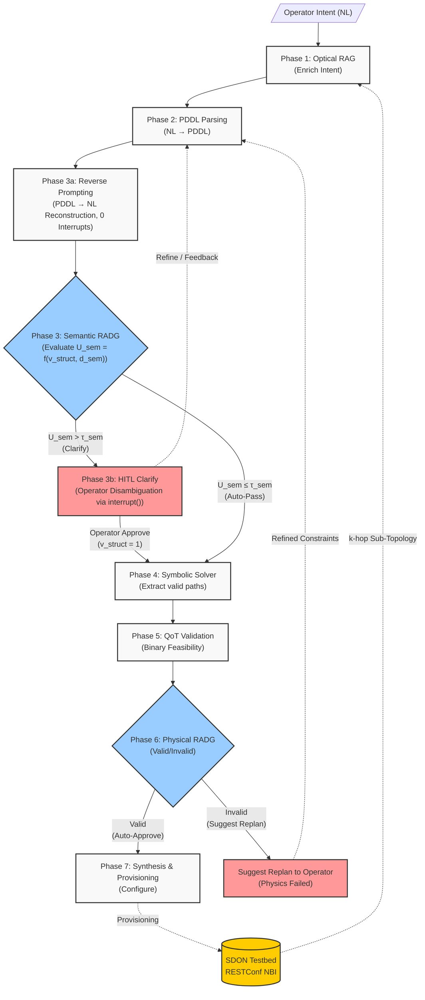

# Architecture V5: LLM-Assisted Risk-Adaptive Decision Gates for Intent Based Optical Networks

## 1. Executive Summary

This document defines the system architecture for the **LLM-Assisted Risk-Adaptive Decision Gates** of Intent Based Optical Networks (IBON). This version introduces the **Risk-Adaptive Decision Gates (RADGs)** mechanism designed fundamentally to **optimize Human-in-the-Loop (HITL) operator interventions**. It acts as a pre-deployment, fail-fast mechanism that sequentially evaluates semantic uncertainty and physical-layer QoT risk to determine the appropriate action for each operator intent, minimizing cognitive overload while ensuring absolute network safety.

The system translates natural language intent into PDDL. Before executing expensive symbolic solvers and physical simulations, the **Semantic RADG** evaluates if the intent is clear, triggering a targeted HITL request for missing data if it is not. Once semantically clear, the system filters valid topologies, validates physical feasibility, and applies the **Physical RADG** to decide whether the plan should be **auto-approved**, **suggest replanning** with alternative paths, or **rejected** to prevent unfeasible deployments.

**Key distinction from prior work:** Existing systems rely on reactive post-deployment configurations and heuristic LLM trial-and-error loops *after* a deployment failure occurs. This architecture applies a fail-fast risk evaluation *before* deployment, saving compute by catching semantic ambiguity early and preventing physically infeasible lightpaths from reaching the network controller.

**Evolution rationale:** See [[Scope_Pivot_20260706]] for the complete architectural journey from V2 through V5.

## 2. Design Principles

1. **Strict Neurosymbolic Separation.** The LLM does not decide optical routes — it only translates intent into formal PDDL constraints. A non-neural symbolic solver determines path feasibility.
2. **Risk-Proportional HITL Engagement.** The operator is not always interrupted (expensive, slow) nor never consulted (unsafe). The RADG engages the human only when the assessed risk warrants it, based on joint semantic and QoT signals.
3. **Pre-Deployment Safety & HITL Optimization.** No configuration is pushed to the network without passing the RADG. Unlike post-deployment retry systems, physically infeasible or semantically ambiguous plans are caught before they can cause harm. Concurrently, the RADG optimizes HITL engagement, filtering out trivial approvals to prevent operator fatigue.
4. **Context Bounding Optimization.** Rather than dumping the entire RESTConf topology JSON into the LLM, a topological extraction layer fetches only the localized $k$-hop neighborhood required, preventing context window saturation and reducing prompt tokens.
5. **Modular Production Design.** The PDDL symbolic solver, Mock GraphRAG, and the RADGs are implemented as decoupled, testable pure-Python modules adhering strictly to `src/core/` domain boundaries.

## 3. System Overview

### 3.1 Architecture Diagram

## 4. Phase-by-Phase Workflow

### Phase 1: Intent Ingestion & Optical RAG
The operator submits a natural language request. The system connects to the testbed via Mock GraphRAG to dynamically extract a $k$-hop neighborhood around the requested nodes. It may also query local documentation (ITU-T specs) to add missing context, combining these into an enriched prompt containing the dynamic `topology_context` for the LLM.

### Phase 2: PDDL Parsing (CFG Validated)
The LLM reads the enriched intent and generates a simplified PDDL string. A deterministic CFG (Context-Free Grammar) AST validator checks the string for syntactical and grammar correctness ($v_{struct} \in \{0, 1\}$), blocking structural hallucinations.

### Phase 3: Automated Reverse Prompting & Semantic RADG ($U_{sem}$)
Implementing a **fail-fast** principle, the system assesses Semantic Uncertainty ($U_{sem}$) *before* any complex routing or physics calculations:
- **Phase 3a (Reverse Prompting):** Automated PDDL $\to$ Natural Language reconstruction ($\mathcal{I}_{recon}$) executed by the LLM without human interruption.
- **Layer 1 (Structural)**: Did the PDDL pass CFG validation ($v_{struct}$)?
- **Layer 2 (Semantic)**: Does the Reverse Prompting reconstruction match the original operator intent ($d_{sem}$)?
- **Gate Evaluation**: $U_{sem} = 1.0$ if $v_{struct}=0$, else $U_{sem} = d_{sem}$.
- **Autonomous Pass**: If $U_{sem} \le \tau_{sem}$ (default 0.3), the pipeline proceeds directly to Phase 4 with **0 human interruptions**.
- **Phase 3b (HITL Clarification)**: If $U_{sem} > \tau_{sem}$, execution pauses via `interrupt()`, presenting $\mathcal{I}_{recon}$ and ambiguity metrics to the operator. If the operator decides to refine, feedback loops back to Phase 2. If the operator explicitly approves the current understanding (allowed when $v_{struct}=1$), execution bypasses re-parsing and proceeds directly to Phase 4 (Symbolic Solver).

### Phase 4: Symbolic Solver
The validated PDDL constraints are sent to a Python-based symbolic solver. The solver mathematically calculates 3–5 candidate paths that satisfy the topological rules.

### Phase 5: QoT Validation
The structurally valid paths are sent to the Python QoT Tool (GN-model port). The tool computes the exact GSNR for each candidate and produces a binary feasibility verdict ($\text{GSNR}_{computed} \ge \text{GSNR}_{threshold}$).

### Phase 6: Physical RADG
This gate evaluates the binary physical feasibility of the proposed paths:

| Decision | Condition | Action |
|----------|-----------|--------|
| **Auto-Approve** | Valid (Feasible) | Proceed directly to Synthesis — no human review needed |
| **Suggest Replan** | Invalid (Unfeasible) | Physics failed. Notify operator and suggest relaxing constraints (e.g. lower GSNR or protection) via HITL $\to$ Loop back to Phase 2. |

### Phase 7: Synthesis & Provisioning
The Orchestrator summarizes the feasible, approved paths into a Planning Report including the full decision trace. Upon final approval, the configuration is pushed to the testbed via SSH/RESTConf.

## 5. Technology Stack (MVP Focused)

| Component | Technology | Package/Location |
|-----------|-----------|--------------------|
| Orchestration framework | LangGraph | `langgraph` |
| LLM provider | Kimi / OpenAI compatible | `langchain-openai` / `src/core/llm.py` |
| State persistence | LangGraph Checkpointer | `langgraph` (`InMemorySaver` / Postgres) |
| PDDL Validator | Python CFG AST Parser | `src/core/pddl_validator.py` |
| Symbolic Solver | Python / networkx | `src/core/symbolic_solver.py` |
| GraphRAG | Mock Python / networkx | `src/core/mock_graphrag.py` |
| QoT Validation | Python GN-Model Port | `src/tools/qot_tool.py` + `src/core/qot_calculator.py` |
| **Physical RADG** | **Python Decision Module** | **`src/core/radg.py`** + **`src/nodes/radg_node.py`** |
| **Semantic RADG** | **Mathematical Gate + Judge** | **`src/core/semantic_gate.py`** + **`src/nodes/semantic_gate_node.py`** |
| Testbed NBI | SSH / RESTConf | `src/services/testbed_client.py` |

## 6. `src/` Folder Convention

All source code follows the placement methodology defined in `.agents/rules/src-methodology.md`:

| Folder | Contents | LLM Calls |
|--------|----------|-----------|
| `src/core/` | Domain logic, physics engines, state, constants, algorithms | ❌ Never |
| `src/nodes/` | LangGraph node functions (one per pipeline phase) | ✅ May |
| `src/tools/` | LangChain `@tool` wrappers | ❌ Never |
| `src/services/` | External I/O adapters (testbed, SSH) | ❌ Never |

## 7. Feature Documentation Map

Each pipeline phase has a dedicated feature doc in `docs/LLM_Wiki/wiki/architecture/features/`:

| Phase | File(s) | Feature Doc |
|-------|---------|-------------|
| **Phase 1**: Intent Ingestion | `src/nodes/intent_ingest.py` | [[architecture/features/intent_ingest]] |
| **Phase 2**: PDDL Parsing | `src/nodes/pddl_parser.py` + `src/core/pddl_validator.py` | [[architecture/features/pddl_parser]] |
| **Phase 3a**: Reverse Prompting | `src/nodes/reverse_prompt.py` | [[architecture/features/reverse_prompt]] |
| **Phase 3**: Semantic RADG & Phase 3b HITL | `src/core/semantic_gate.py` + `src/nodes/semantic_gate_node.py` + `src/nodes/reverse_prompt.py` | [[architecture/features/semantic_gate]] |
| **Phase 4**: Symbolic Solver | `src/core/symbolic_solver.py` + `src/core/mock_graphrag.py` | [[architecture/features/symbolic_solver]] |
| **Phase 5**: QoT Validation | `src/core/qot_calculator.py` + `src/tools/qot_tool.py` | [[architecture/features/qot_tool]] |
| **Phase 6**: Physical RADG | `src/core/radg.py` + `src/nodes/radg_node.py` | [[architecture/features/radg]] |
| **Phase 7**: Synthesis | `src/nodes/plan_synthesizer.py` | [[architecture/features/plan_synthesizer]] |
| **Testbed NBI** | `src/services/testbed_client.py` | [[architecture/features/testbed_client]] |
| **Pipeline Wiring** | `src/core/graph.py` + `src/core/state.py` | [[architecture/features/pipeline_graph]] |

## 8. Cross-References

- [[Scope_Pivot_20260706]] — Complete architectural evolution from V2 through V5.
- [[ProblemStatement_v5]] — Thesis problem definition with evaluation framework.
- [[experiments/MVP_Roadmap]] — Sprint plan including RADG implementation and baseline evaluation.
- [[literature/sota_gap_analysis]] — Gap analysis positioning against SOTA.
